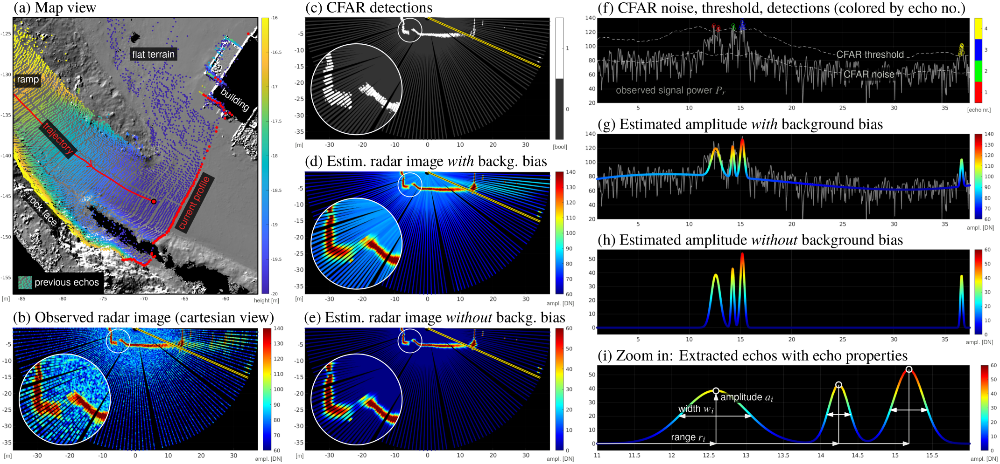
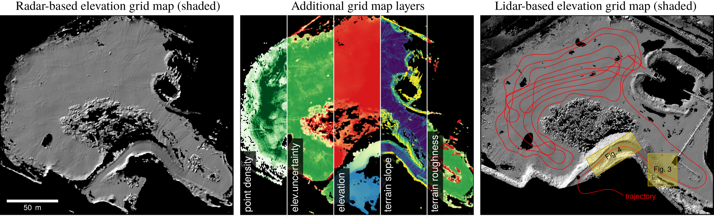
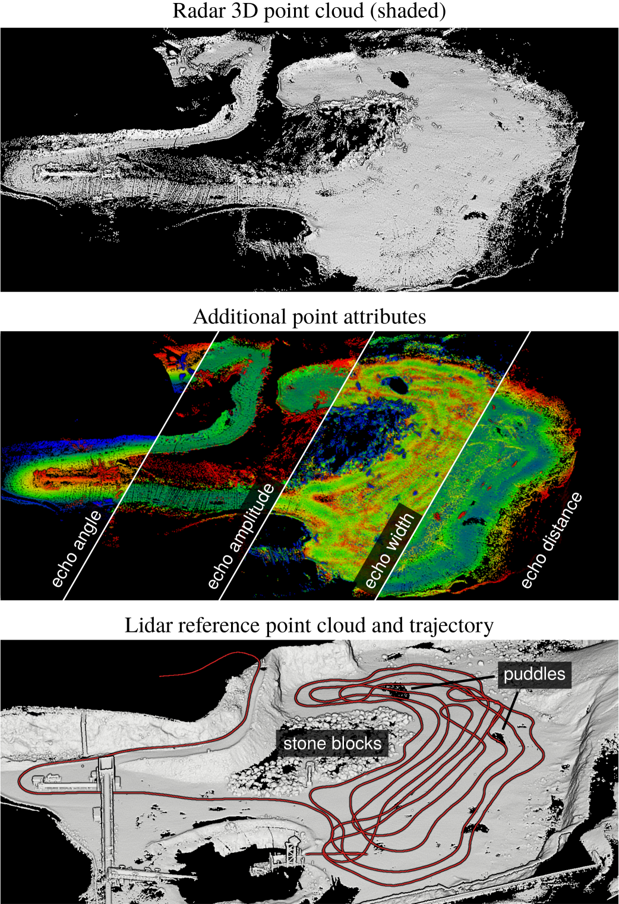

We've published a new paper with the title "3D Mobile Mapping of the Environment using Imaging Radar Sensors" at the [RadarConf2022](https://www.radarconf2022.org).

### Authors

Philipp Glira, Christoph Weidinger, Thomas Kadiofsky, Wolfgang Pointner, Katharina Ölsböck, Christian Zinner, Masrur Doostdar

### Abstract

For 3D sensing of the environment, lidar sensors and stereo cameras are mostly used. These sensors work best in an ideal environment, i.e. with clear visibility. Radar, however, is widely unaffected by external influences (like rain, snow, fog, or dust) due to its longer wavelength, e.g. 4mm@77GHz. In this work we investigate the capabilities of an FMCW imaging radar sensor mounted on a mobile platform for 3D topographic mapping. We describe our radar processing pipeline and introduce thereby a new method to extract and model radar targets from radar images and a new method to estimate the extrinsic calibration of radar sensors. We demonstrate these developments by generating a radar-based 3D point cloud and multi-layer grid map of a quarry.

### Selected Figures

Concept of radar signal decomposition into a series of Gaussian distribution functions.

Left: elevation grid map derived from the 3D radar point cloud as hillshade. Center: additional grid map layers derived from the 3D radar point cloud. Right: High-resolution lidar data as reference with trajectory (red).

The generated 3D radar point cloud with additional point attributes. Bottom: Lidar reference point cloud generated with terrestrial laser scanning (TLS), as well as the trajectory of the vehicle (red line).